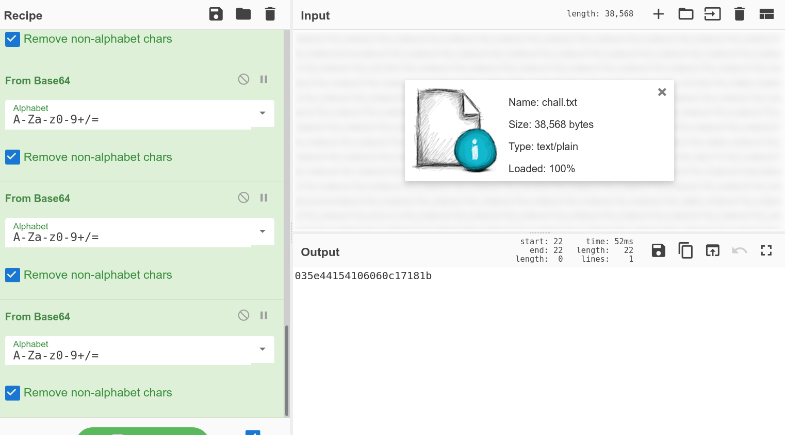

# Try try but don't cry
**category: cryptography**  
**points: 449**

## Description
So many b64 and hex encodings.  
We are given a [cipher text](./chall.txt) and the [python script](./chall.py) used to make it.

## Solution
After reading the script, it looks like the flag is split into halves, then the characters from each half is xored with each other.
Then it is encoded in hex, and the loop at the end randomnly encodes the flag with hex and base64. I used [Cyberchef](https://gchq.github.io/CyberChef/) to manually decode until I reach the last hex-encoded string.

Since we know the flag is in b00t2root{.\*} format, we can manually decode the xor. The original flag is split into 2 parts:  
- b00t2root{_
- __________}
And the output is 035e44154106060c17181b.  

We can xor the known characters with the hex string, and get the rest of the flag.
- 'b' ^ 03 = 'a'
- '0' ^ 5e = 'n'
- '0' ^ 44 = 't'
- 't' ^ 15 = 'a'
- '2' ^ 41 = 's'
- 'r' ^ 06 = 't'
- 'o' ^ 06 = 'i'
- 'o' ^ 0c = 'c'
- 't' ^ 17 = 'c'
- '{' ^ 18 = 'c'
- '}' ^ 1b = 'f'

**FLAG:** `b00t2root{fantasticc}`
