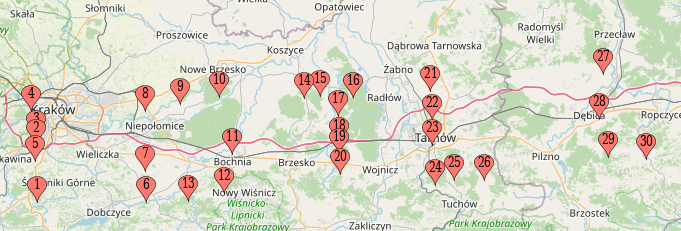

# Path of the suspect

**Category**: OSINT \
**Points**: 425

The first thing I did was Google what MCC, MNC, LAC, and CID were. Eventually,
I found a tool called https://opencellid.org that would find locations based on
these values.

So next I wrote a script ([parse.py](parse.py)) to parse the PDF text into some easily readable
JSON like so:
```json
[
    {
        "day": "11.11.2020",
        "time": "12:04",
        "mcc": 260,
        "mnc": 3,
        "lac": 52911,
        "cid": 8961,
        "rtype": "GSM"
    },
    {
        "day": "11.11.2020",
        "time": "13.09",
        "mcc": 260,
        "mnc": 6,
        "lac": 206,
        "cid": 1658726,
        "rtype": "UMTS"
    },
```

Next I wrote another script that would send a request to OpenCelliD and read the
location:


```python
import requests
import pprint
import json
import time

url = 'https://www.opencellid.org/ajax/searchCell.php'

with open('src.json', 'r') as f:
    src = json.load(f)

locs = []

for cell in src:
    payload = {
        'mcc': cell['mcc'],
        'mnc': cell['mnc'],
        'lac': cell['lac'],
        'cell_id': cell['cid']
    }

    response = requests.request('GET', url, params=payload)
    print("Received loc: ", response.json())
    locs.append(response.json())
    time.sleep(5)  # Avoid rate-limiting

with open('locs.json', 'w') as f:
    f.write(json.dumps(locs, indent=4))
```

The format of the `locs.json` was like this:
``` json
[
    {
        "lon": "19.894857",
        "lat": "49.91982",
        "range": "4594"
    },
    {
        "lon": "19.891884",
        "lat": "50.019426",
        "range": "1000"
    },
```

Next I needed a way to plot these on a map, so I decided to use https://www.mapcustomizer.com/.
I wrote a short script ([proc.py](proc.py)) to convert `locs.json` into a format that it liked:
```python
import json
import matplotlib.pyplot as plt

with open('locs.json', 'r') as f:
    locs = json.load(f)

with open('mapconv', 'w') as f:
    for loc in locs:
        f.write("{},{}\n".format(loc['lat'], loc['lon']))
```

Then I pasted the `mapconv` file contents into the "Bulk Entry" modal and got
this map:


Finally after several hours of work, the flag was `AFFCTF{IOTLL}`
