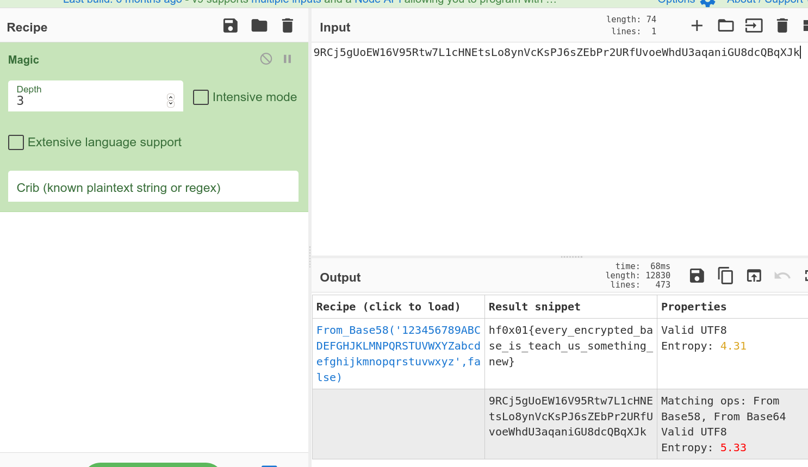

# Base Fun
**category: crypto**  
**points: 100**

## Description
Cipher Is In File :) Check File.
We are given a file [chall.txt](), recover the flag.

## Solution
Usually, the first thing I do after downloading a file is to check its type. 
```
$ file chall.txt
chall.txt: ASCII text
```

Now lets see whats inside this file.
```
$ cat chall.txt
QEgAAAoDAAAAALxtdFHz9fhaSgAAAEoAAAAIAAAAYmFzZS50eHQ5UkNqNWdVb0VXMTZWOTVSdHc3TDFjSE5FdHNMbzh5blZjS3NQSjZzWkViUHIyVVJmVXZvZVdoZFUzYXFhbmlHVThkY1FCcVhKa1BLAQI/AwoDAAAAALxtdFHz9fhaSgAAAEoAAAAIACQAAAAAAAAAIICkgQAAAABiYXNlLnR4dAoAIAAAAAAAAQAYAIDzxmBtv9YBgPi5pG2/1gGA88Zgbb/WAVBLBQYAAAAAAQABAFoAAABwAAAAAAA=
```  

Looks like base64. lets decode this.
```
$ cat chall.txt | base64 -d
@H
mtQZJbase.txt9RCj5gUoEW16V95Rtw7L1cHNEtsLo8ynVcKsPJ6sZEbPr2URfUvoeWhdU3aqaniGU8dcQBqXJkPK?
mtQZJ$ base.txt
 `mm`mPKZp
```

We can see there is base.txt in the output. At the end of the output, there is `PK`, which looks like the trailer for zip files. This might be a zip file. The header of a zip file should be `PK..`, lets fix it.
```
$ cat chall.txt | base64 -d > out.zip
$ printf '\x50\x4b\x03\x04' | dd of=out.zip bs=1 count=8 conv=notrunc
4 conv=notrunc
4+0 records in
4+0 records out
4 bytes copied, 9.4149e-05 s, 42.5 kB/s
```

After that we can unzip the file to get base.txt.
```
$ unzip out.zip
Archive: out.zip
  extracting: base.txt
```

Now lets see the contents of base.txt.
```
$ cat base.txt
9RCj5gUoEW16V95Rtw7L1cHNEtsLo8ynVcKsPJ6sZEbPr2URfUvoeWhdU3aqaniGU8dcQBqXJk
```

Looks like another base64 string. Lets decode it.
```
$ cat base.txt | bsae64 -d
(mzWQ
     ̧U¬<dFϯe}Kyh]SvjxS\@&base64: invalid input)
```

The output is gibberish and it says invalid input. Even after appending '=' to the end of the string, it still says invalid input. Maybe this isn't a base64 string. I then used [CyberChef](https://gchq.github.io/CyberChef/) to guess the encoding.



There is the flag! It turns out the string was base58 encoded.  
**FLAG:** `hf0x01{every_encrypted_base_is_teach_us_something_new}`

